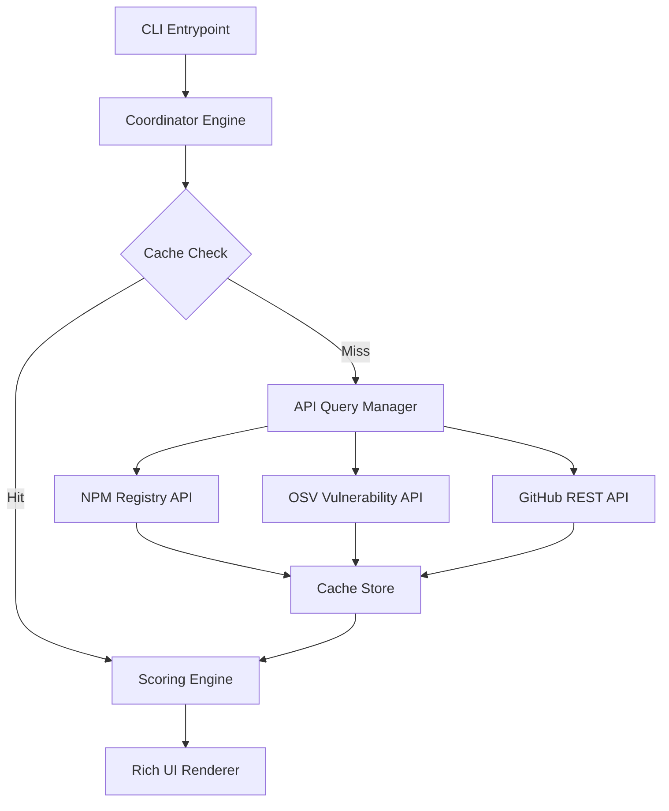

# Revera Technical Architecture

Revera is designed as a standalone CLI reputation tool. This document details the flow of data and the engine configuration.

## System Flow

## Core Modules

### 1. Cli Interface (`src/cli.ts`)
Built using Commander.js, the CLI routes user arguments. It maps commands and sets options for offline runs.

### 2. API Queries (`src/engine/`)
* **NPM Registry**: Fetches details for the latest versions, dependencies, license formats, script names, and modified dates.
* **Downloads**: Fetches weekly package metrics.
* **GitHub**: Retrieves repository metadata, stars, fork counts, contributors, and active commit records over the last 90 days.
* **OSV Vuln DB**: Checks version-specific vulnerability listings using post-queries.

### 3. File Helpers (`src/utils/`)
* **caching**: File-based system. Stores response profiles inside `~/.revera/cache/`.
* **configuration**: Manages tokens, package manager choices, and threshold levels inside `~/.revera/config.json`.
* **pm**: Automatically detects lockfiles (`pnpm-lock.yaml`, `package-lock.json`, etc.) to run matching installation processes.
